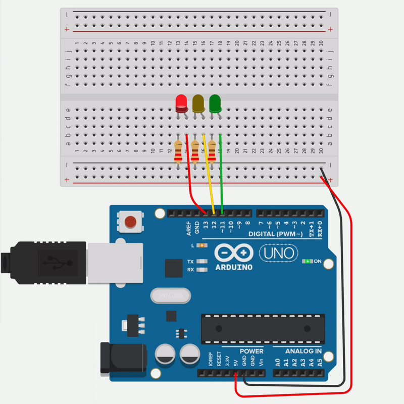

 Project type: PlatformIO(.cpp)
# Traffic lights / Racing lights

This project is about is about traffic lights.

# Kit
**arduino**, **diod**, **breadboard**.

-------

After I coded m´for my traffic ligts i got ispiration from racing formel 1. So I decided to make sounds that will sync with the delay of the traffic lights and for that I used a 
**buzzer** 

I managed to make a succesful code for a buzzer. I haven't used the code together with the arduino yet.